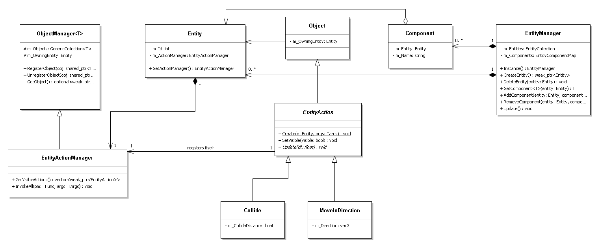

### Summary

A simple ECS system was implemented with addition of EntityAction.

In [common ECS implementations](https://en.wikipedia.org/wiki/Entity_component_system#References), Entity is a mean to associate Components that contain data. Then there are Systems which operate on all entites containing certain set of components.

In this implementation, I also created Components which can be created and added on Entity
but since the requirements contain EntityActions, I decided to make their role similar to that of Systems in standard ECS.
Therefore, they contain logic and can operate on any component that belongs to same (or even different) entity.

The main difference between Component and EntityAction is that Component does not have an Update function to encourage it's usage for data storage.
Another difference is in the way they are created and how they are obtained once they are created.
EntityActions belongs to EntityActionManager that belongs to the Entity. Every Entity has their own EntityActionManager.
Components are created and obtained via EntityManager singleton object and all Entities and their components are saved in it.

The reasons behind this are 

1. to demonstrate usage of Singleton pattern used to access a manager
2. to make a first step towards continuous storage of Components. One of the reasons for using ECS is that Components can be stored continuously in memory, making their processing via System cache friendly.

### UML
This is a simple UML graph illustrating relationships between core components of the system.

### Usage

The project contains [FrameworkTest.cpp](/BITFramework/src/Tests/FrameworkTest.cpp) file that demonstrates usage and manipulation with Entities and EntityActions and which also serves as test for the framework.

I also implemented custom container for ObjectManager with it's custom Iterator and ConstantIterator classes.
The project contains [TestGenericCollection.cpp](/BITFramework/src/Tests/GenericCollectionTest.cpp) file that demonstrates usage of the collection and also serves as unit test.

The solution also contains BITGame project that serves as comprehensive example of how the framework can be used in real-world usage.
A simple game has been implemented. All the important logic is contained in [Game](BITGame/src/Game.cpp) class as well as simple Command pattern implementation.
I also implemented simple [EventDispatcher](/BITFramework/src/Core/Events/EventDispatcher.cpp) for decoupling between caller and callee.

### Build & Run
Project files for your IDE as well as binaries can be build using Cmake.

Batch files for convenient building and running on Windows are provided in root folder.

1. Run cmake_VS.bat to generate project files for Visual Studio 2022.

1. Run cmake_Build.bat to build the solution using msvc.

1. Run run_game.bat to run the game or run the test versions to run the tests.

On another platforms, run cmake commands appropriate to that platform and IDE (or use CMake GUI)

### Limitations/Potential future work

* Custom EntityActions should have Init method to use to initialize themselves like getting some components or other actions. Currently the initialization happens in construction before the whole entity is constructed. That means if we relly on some other Component or EntityAction to be added they might not be constructed yet (If construction EntityAction like Guard is used).

* The order of adding actions on entites or just creating entites matter if you update them all in bulk based on that order. It might be good to introduce some dependency declaration in actions so that they can be properly scheduled.

* Only one type of object (EntityAction) should be allowed to be added to ActionManager.

* Currently, weak_ptr is used for getting resource that can be invalidated like Entity, EntityAction or Component. Any party can hold these references and needs to make sure that they are still alive by checking weak_ptr::expired() This system has problem though because by locking the resource we create shared_ptr which increases the resource reference count and if the resource is suppose to be removed (i.e. the holding entity was deleted) then it isn't and using it can cause access to deleted memory. Ideally, custom class would be created that can hold reference to underlaying resource and check it's liveability but does not allow preventing it from being removed.

### Spent time report

* Initial implementation(structure and classes according to requirements) - **8h**
* Additional implementation(Components) - **4h**
* Custom collection, iterator and vec3 classes - **8h**
* Implementation of custom Components and EntityActions to demonstrate basic usage - **4h**
* Implementation of use case in form of the game including more custom components, game logic, Command classes, Grid class, EventDispatcher class. **2.5 days**
* Writing use cases, tests, report, UML, packaging and polish - **4h**

Total: **6 days**
